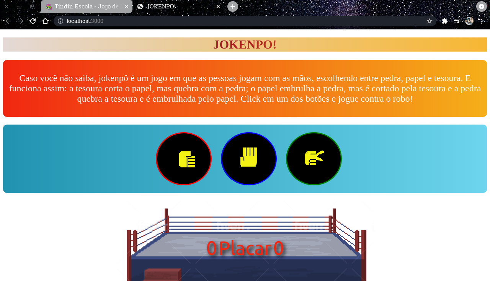

# JOKENPO!

Um jogo de jokenpo(pedra, papel ou tesoura) criado como desafio do curso da escola Tindin.

- Faça o clone do repositório
- Instale as dependências com ```npm install``
- Execute `npm start`
- O comando `npm test` ou `npm t` executa o testes


